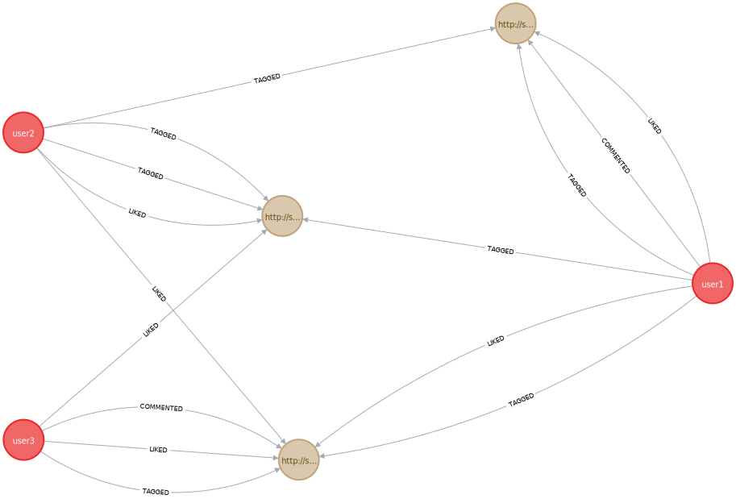

# MAC - Projet
Projet de groupe MAC, Lionel Widmer & Nicodèle Stalder

## Cahier des charges

### Contexte
Création d'un mini réseau social permettant à des utilisateurs d'associer à des documents des tags liés une idéologie, un parti politique, un courant de pensée. Par exemple, si un utilisateur estime que le contenu d'un document a rapport à un courant politique appelé "protectionisme", il peut le tagger comme tel.
L'utilisateur peut aussi liker ou disliker un document, et commenter un document.

### Fonctionnalités implémentées
L'application tourne sous la forme d'un bot Telegram. Toutes les intéractions se font donc directement depuis Telegram.
Les actions à réaliser par l'utilisateur sur le réseau social se font par l'intermédiaire d'un bot, et de commandes envoyées à ce bot.
Comme un document peut être identifié par une URL, l'utilisateur les ajoute en donnant l'URL au bot.
Voici ce que le bot permet de faire:
* Ajouter un document
* Liker / Disliker / annuler un like ou dislike sur un document
* Commenter un document
* Tagger un document
* Récupérer les tags connus de l'application ainsi que le nombre de fois que chacun est utilisé
* Récupérer la liste des documents
* Pour un document précis, récupérer: commentaires, nombre de likes/dislikes et utilisateurs associés
* Récupérer la liste des utilisateurs enregistrés (utile pour le point suivant)
* Pour un utilisateurs donné: Tags associés à des documents likés / dislikés par l'utilisateur
* Récupérer la liste des tags connus ainsi que le nombre de documents dans lesquels chaque tag est utilisé
* Pour un tag donné, récupérer la liste des users qui l'ont utilisé
* Afficher la date de compilation (utile pendant le développement, pour vérifier que les déploiements automatiques sur serveur aient bien eu lieu)

Les fonctionnalités plus complexes suivantes ont également été implémentées:
* Afficher l'utilisateur qui est le plus "inverse de nous" qui nous a contredit le plus de fois
* Afficher l'utilisateur qui est le plus "inverse de nous" pour lequel le ratio "accord-désaccord" est le plus important
* Retourne les utilisateurs qui ont voté différemment que nous à propos de documents, alors qu'ils ont voté comme nous pour au moins un document

Toutes les fonctionnalités sont documentées au sein même du bot (en tapant "/", la liste des commandes à disposition ainsi qu'une brève description (en anglais) est affichée intéractivement par Telegram).


## Technologies utilisées
### Base de données graphes
La base de données graphes, qui sert à stocker les documents et les utilisateurs, tourne avec Neo4J. Les noeuds sont les documents et les utilisateurs, et les arrêtes sont les actions (like, comment, tag, ...).

### Bot
Le bot, comme dit précédemment, est un bot Telegram. Un programme Java écoute les events du bot, en mode long-polling,ce qui signifie que le serveur ou le poste de travail jouant le rôle du bot n'a besoin que d'un accès internet sortant, en direction de l'API Telegram. Nous nous sommes appuyés sur les librairies TelegramBot pour faire le développement du bot (https://github.com/rubenlagus/TelegramBots)

### Docker
Neo4j ainsi que le bot ont été containerisé dans Docker, dans le but de le rendre portable et facilement installable. L'image neo4j est brute de fonderie, ce qui signifie que nous exécutons simplement un container sur la base de l'image neo4j officielle publiée sur Docker Hub. Concernant le bot, nous construisons notre propre image (non-publiée sur une registry Docker!). L'image est construite en mode "multi-stage build" car nous exécutons d'abord un container Maven, pour faire la compilation, puis un container Java exécute le fichier .jar compilé par le container Maven temporaire.
Le choix du multi-stage build se justifie par le fait que nous ne voulions pas que les utilisateurs doivent coûte que coûte compiler en local, donc avoir Maven et un JDK.


## Data model and analytic queries
[data_model_and_analytic_queries](doc/data_model_and_analytic_queries.md)

## Instructions de développement / d'installation
### Prérequis
Il est nécessaire d'avoir les logiciels suivants installés:
* Docker
* docker-compose (suivant l'OS, installé automatiquement avec Docker)
* IntelliJ avec un JDK (pour le développement uniquement)

Pour la machine qui fera tourner le bot:
* Connexion internet (en sortie, pas de port en entrée nécessaire)


### Création du bot
Tout d'abord, vous devez posséder un bot Telegram. Pour cela, il faut suivre les instructions officielles de Telegram, disponibles ici: https://docs.microsoft.com/en-us/azure/bot-service/bot-service-channel-connect-telegram?view=azure-bot-service-4.0
En résumé, il suffit de démarrer une conversation avec @BotFather puis de lui envoyer l'instruction /newbot
Bien noter le nom du bot (bot username) ainsi que la Token API key. Nous aurons besoin de ces informations plus tard

### Cloner ce projet
```bash
git clone https://github.com/HEIGVD-MAC-project-Widmer-Stalder/MAC_project.git
```

### Instructions pour le développement
Pour le développement, il est plus facile de faire tourner le bot sur IntelliJ et non dans un container Docker. Seules les DB seront dans des containers Docker. Comme les containers de DB doivent être accessibles depuis le host, il est plus facile d'exposer les ports nécessaires (ce qui ne doit pas être fait en production). Du coup, nous avons créé deux fichier docker-compose différents.

#### Création des containers de DB
Depuis la racine du projet:
```bash
docker-compose -f docker-compose.developmenty.yml up -d
```

#### Configuration du bot
Dans la configuration d'exécution d'IntelliJ, rajouter les variables d'environnement suivantes:
* TELEGRAM_BOT_USERNAME : Username du bot Telegram
* TELEGRAM_BOT_SECRET_TOKEN : Token associé au bot
* NEO4J_HOST : localhost
* NEO4J_USER : neo4j
* NEO4J_PASSWORD : test

Les valeurs ne sont volontairement pas hardcodées dans le code mais prises de l'environnement d'exécution, car ce sont des données sensibles ne devant pas se retrouver sur internet.


#### Compilation et exécution
Le bot peut maintenant être lancé, en exécutant simplement la classe src/main/java/Main.java depuis IntelliJ. En cas de problème de connexion à la DB ou autre, les erreurs sont affichées dans la console IntelliJ. Le bot devrait être fonctionnel.

#### Affichage de la DB neo4j depuis la console neo4j
La console neo4j est accessible depuis l'URL http://localhost:7474

#### Injection de données de test dans la DB
Afin de pouvoir facilement faire des expérimentations avec le bot, il est possible d'injecter des données de test dans la DB. Le plus simple est de copier-coller le contenu ci-dessous dans la console neo4j:
```cypher
CREATE (user1:User {telegramId: 1, username: 'user1'})
CREATE (user2:User {telegramId: 2, username: 'user2'})
CREATE (user3:User {telegramId: 3, username: 'user3'})

CREATE (doc1:Document {url: 'http://some_url1.com'})
CREATE (doc2:Document {url: 'http://some_url2.com'})
CREATE (doc3:Document {url: 'http://some_url3.com'})

CREATE (user1)-[:TAGGED{label: 'a'}]->(doc1)
CREATE (user1)-[:TAGGED{label: 'b'}]->(doc2)
CREATE (user1)-[:TAGGED{label: 'c'}]->(doc3)

CREATE (user2)-[:TAGGED{label: 'a'}]->(doc1)
CREATE (user2)-[:TAGGED{label: 'f'}]->(doc3)
CREATE (user2)-[:TAGGED{label: 'c'}]->(doc3)

CREATE (user3)-[:TAGGED{label: 'c'}]->(doc2)

CREATE (user1)-[:LIKED{coef: 1}]->(doc1)
CREATE (user1)-[:LIKED{coef: -1}]->(doc2)
CREATE (user1)-[:COMMENTED{comment: 'This is neither a smart idea nor does it aims to something valuable in my view.'}]->(doc1)

CREATE (user3)-[:LIKED{coef: 1}]->(doc2)
CREATE (user3)-[:COMMENTED{comment: 'Interesting document.'}]->(doc2)
CREATE (user3)-[:LIKED{coef: 1}]->(doc3)

CREATE (user2)-[:LIKED{coef: -1}]->(doc2)
CREATE (user2)-[:LIKED{coef: 1}]->(doc3)
```

### Instructions pour la mise en production
Pour la mise en production de l'application, nous fournissons une version entièrement containerisées de l'application, qui n'expose pas les ports des DB's en externe (utilisation des communication inter-containers et la résolution de noms interne à Docker).


#### Configuration du bot
Depuis un terminal, la première chose à faire est de configurer les variables d'environnement afin que le container puisse se connecter à l'API et à la DB
```bash
export TELEGRAM_BOT_USERNAME=<bot_username>
export TELEGRAM_BOT_SECRET_TOKEN=<bot_secret_token>
export NEO4J_HOST=neo4j
export NEO4J_USER=neo4j
export NEO4J_PASSWORD=test
```

Bien-sûr, remplacer <bot_username> et <bot_secret_token> par les valeurs adéquates.


#### Création des containers
Tous les containers (DB's, bot) sont créés automatiquement en lançant docker-compose de la manière suivante, depuis la racine du projet. Il faut exécuter docker-compose depuis le même terminal que l'étape précédente, sinon les variables d'environnement seront perdues:
```bash
docker-compose -f docker-compose.production.yml up -d --build
```

Le bot devrait maintenant être fonctionnel. Afin de vori les logs en live (équivalent de regarder les logs dans la console IntelliJ), il faut lancer la commande suivante:
```bash
docker logs -f bot
```
Pour interrompre l'affichage des logs (le container n'es pas interrompu!), faire la combinaison de touches CTRL+C


## Modèles de données
### Base de données graph
Le modèle de la DB graph se compose de deux types de noeuds:
* Utilisateurs. Un utilisateur a deux propriétés: Son username et son id Telegram
* Documents. Un Document possède une propriété: Son URL

Il y'a 3 types de relations possibles entre les deux types de noeuds:
* Liked. Cette relation possède une propriété, nommée coef, qui es mise à 1 si l'utilisateur a liké, et à -1 s'il a disliké.
* Commented. Cette relation possède une propriété, nommée comment, qui contient le commentaire.
* Tagged. Cette relation possède une propriété, nommée label, qui contient le tag.


__legend:__ noeuds verts: documents, yellow nodes: users.


## Explication des requêtes avancées
Afficher l'utilisateur qui est le plus "inverse de nous" qui nous a contredit le plus de fois
```cypher
MATCH (user:User{username:$username})-[lu:LIKED]->(d:Document) MATCH (other_user:User)-[lou:LIKED]->(d) WHERE lu.coef<>lou.coef RETURN other_user, count(other_user) AS diff ORDER BY diff"
```

Afficher l'utilisateur qui est le plus "inverse de nous" pour lequel le ratio "accord-désaccord" est le plus important
```cypher
MATCH (user:User{username:$username})-[lu:LIKED]->(d:Document) MATCH (other_user:User)-[lou:LIKED]->(d) WHERE user <> other_user AND lou.coef <> lu.coef MATCH (user)-[lu2:LIKED]->(d2:Document) MATCH (other_user)-[lou2:LIKED]->(d2) WHERE user <> other_user AND lu2.coef = lou2.coef WITH other_user, COUNT(lou) AS unsim_likes , COUNT(lou2) AS sim_likes WHERE unsim_likes >= 2 AND sim_likes > 0 RETURN other_user, unsim_likes / sim_likes as dislikeness ORDER BY dislikeness
```

Retourne les utilisateurs qui ont voté différemment que nous à propos de documents, alors qu'ils ont voté comme nous pour au moins un document
```cypher
MATCH (user:User{username: $username})-[lu1:LIKED]->(d:Document) MATCH (other_user:User)-[lou1:LIKED]->(d) "WHERE user <> other_user AND lu1.coef = lou1.coef MATCH (other_user)-[lou2:LIKED]->(d2:Document) MATCH (user)-[lu2:LIKED]->(d2) WHERE d <> d2 AND lou2.coef <> lu2.coef RETURN other_user, COUNT(d2) AS c ORDER BY c
```

## Structure du code
La structure du code est assez simple.
La classe Main démarre, appelle la classe Bot, qui va lire les variables d'environnement liées au bot, et va tenter d'enregistrer le bot. En cas d'échec de l'enregistrement du bot, le bot s'arrête.
Toutes les actions (inputs utilisateur) sont gérés par la classe Actions > ActionsResolver. Cette classe charge ensuite la classe correspondante (du package Actions ou exceptions) en fonction de l'input utilisateur.