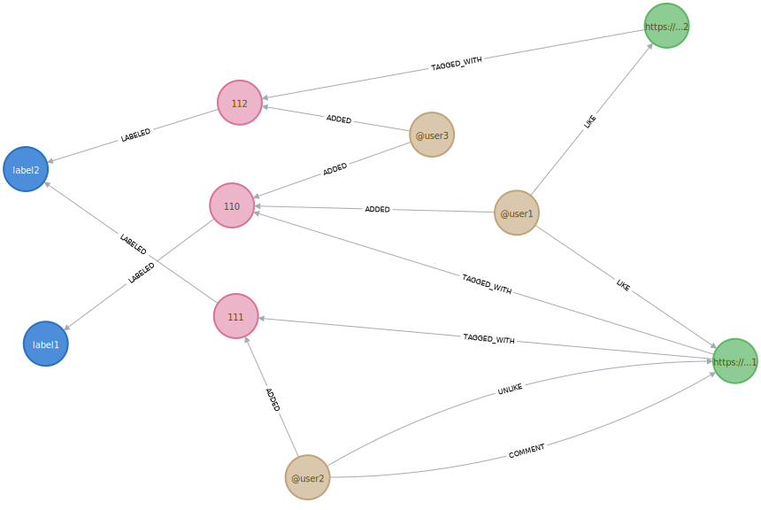

## 1) Graph model
Here is an example to illustrate the graph model.
Graph creation script using cypher as language:
```cypher
CREATE (user1:user {telegramId: '@user1'} )
CREATE (user2:user {telegramId: '@user2'} )
CREATE (user3:user {telegramId: '@user3'} )

CREATE (document1:document {url: 'https://...1'} )
CREATE (document2:document {url: 'https://...2'} )

CREATE (tag1:tag)
CREATE (tag2:tag)
CREATE (tag3:tag)

CREATE (label1:label {name: 'label1'} )
CREATE (label2:label {name: 'label2'} )
CREATE (label3:label {name: 'label3'} )

CREATE (user1)-[:ADDED]->(tag1)
CREATE (tag1)-[:LABELED]->(label1)
CREATE (document1)-[:TAGGED_WITH]->(tag1)

CREATE (user3)-[:ADDED]->(tag1)

CREATE (user2)-[:ADDED]->(tag2)
CREATE (tag2)-[:LABELED]->(label2)
CREATE (document1)-[:TAGGED_WITH]->(tag2)

CREATE (user3)-[:ADDED]->(tag3)
CREATE (tag3)-[:LABELED]->(label2)
CREATE (document2)-[:TAGGED_WITH]->(tag3)

CREATE (user1)-[:LIKE]->(document1)
CREATE (user1)-[:LIKE]->(document2)
CREATE (user2)-[:UNLIKE]->(document1)
CREATE (user2)-[:COMMENT {comment: 'interesting document.'}]->(document1)
```
And here is a visual representation of the graph;

__legend:__ green nodes: documents, yellow nodes: users, pink nodes: tags, blue tags labels.

## 2) Document model
Documents are identified by an url, have a title and a content.
The document model could be represented with a json:
```json
{
  _id: { url: 'https://...' },
  title: 'document title',
  content: 'content',
}
```
## 3) Requests
### Simple requests
- documents: retrieve all documents (or n documents)
- likedBy: retrieve documents that were liked by a user.
- users: retrieve all users (or n users)
- user: retrive simple informations about a user: what he liked and commented
### Advanced Requests
- getDocsByTag: list documents that relate to some specified tags.
- getUsersByTag: list users that relate to some specified tags.
- getUserTag: get tags that seems to relate with the specified user.
- getNUsersClusters: forms n groups of users such as users within a same group are "alike". The exact meaning of alike is not clear yet, but it will probably be based on tags associated to users.
