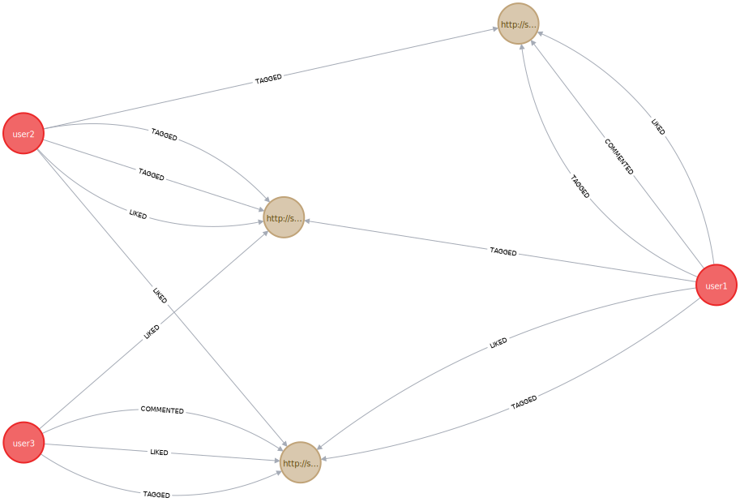

## 1) Graph model
Here is an example to illustrate the graph model.
Graph creation script using cypher as language:
```cypher
CREATE (user1:User {telegramId: 1, username: 'user1'})
CREATE (user2:User {telegramId: 2, username: 'user2'})
CREATE (user3:User {telegramId: 3, username: 'user3'})

CREATE (doc1:Document {url: 'http://some_url1.com'})
CREATE (doc2:Document {url: 'http://some_url2.com'})
CREATE (doc3:Document {url: 'http://some_url3.com'})

CREATE (user1)-[:TAGGED{label: 'a'}]->(doc1)
CREATE (user1)-[:TAGGED{label: 'b'}]->(doc2)
CREATE (user1)-[:TAGGED{label: 'c'}]->(doc3)

CREATE (user2)-[:TAGGED{label: 'a'}]->(doc1)
CREATE (user2)-[:TAGGED{label: 'f'}]->(doc3)
CREATE (user2)-[:TAGGED{label: 'c'}]->(doc3)

CREATE (user3)-[:TAGGED{label: 'c'}]->(doc2)

CREATE (user1)-[:LIKED{coef: 1}]->(doc1)
CREATE (user1)-[:LIKED{coef: -1}]->(doc2)
CREATE (user1)-[:COMMENTED{comment: 'This is neither a smart idea nor does it aims to something valuable in my view.'}]->(doc1)

CREATE (user3)-[:LIKED{coef: 1}]->(doc2)
CREATE (user3)-[:COMMENTED{comment: 'Interesting document.'}]->(doc2)
CREATE (user3)-[:LIKED{coef: 1}]->(doc3)

CREATE (user2)-[:LIKED{coef: -1}]->(doc2)
CREATE (user2)-[:LIKED{coef: 1}]->(doc3)
```
And here is a visual representation of the graph;

__legend:__ green nodes: documents, yellow nodes: users, pink nodes: tags, blue tags labels.

## 2) Document model
Documents are identified by an url, have a title and a content.
The document model could be represented with a json:
```json
{
  "_id": { "url": "https://..." },
  "title": "document title",
  "content": "content",
}
```
## 3) Requests (done through telegram commands)
### Simple requests
- cancel - To cancel current pending command
- add - To add a document
- documents - To print 50 available documents (not implemented yet)
- document - To print some informations about the specified document
- users - To print 50 usernames
- user - To print informations about the specified user
- tag - To Tag a document
- tags - To list 50 existing tags
- comment - to comment a document
- like - To like or dislike a document
- simple_game - Simple game used to test if the bot is available etc..
- info - print compile time (used to check if it is the last version)
- get_users_by_tag - get_users_by_tag
### Advanced Requests
- most_frequent_contradictor -  get user who disliked what you liked or liked what you disliked the most
- most_personal_contradictor - get the user (who disliked at least 3 documents we liked) for whose the ratio between our disagreements and agreements is the higher
- curious_fact_1 - get users and documents that voted differently for a document despite they voted as we did for at least one document. (it also shows for each user the number of documents we disagree on)
